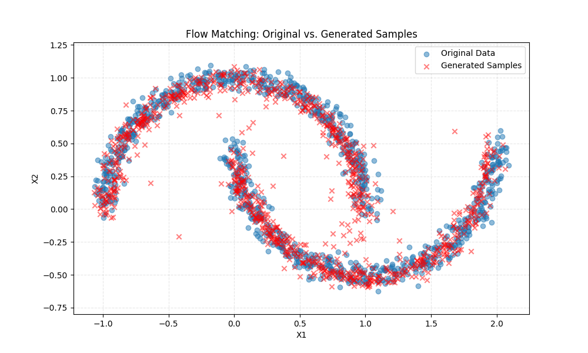

# Simple Flow Matching from Scratch

A minimal PyTorch implementation of (Conditional) Flow Matching for generative modeling on the 'make_moons' dataset. This code is designed to be a simple, easy-to-read demonstration of the core concepts.

## 📈 Example Result

After training, the model learns to transport random noise onto the data manifold, successfully capturing the "two moons" shape.

---

## 🧠 The Core Idea: From Marginal to Conditional Loss

This implementation trains a continuous normalizing flow (CNF) $v_\theta(x, t)$ by reframing the problem as a simple regression.

### 1. The "Ideal" (Intractable) Marginal Loss

Our "ideal" goal is to learn the true **marginal vector field** $u_t(x)$, which describes the flow of the *entire* probability distribution from noise $p_0$ to data $p_1$. We would train our network $v_\theta$ to match this field:

$$
\mathcal{L}_{\text{FM}}(v_\theta) = \mathbb{E}_{t, p_t(x)} \left[ \left\| v_\theta(x, t) - u_t(x) \right\|^2 \right]
$$

This loss is **intractable** because we cannot sample from the intermediate distribution $p_t(x)$ or compute the marginal field $u_t(x)$.

### 2. The "Practical" (Tractable) Conditional Loss

The "trick" is to instead define a simple, computable **conditional path** $\phi_t$ that connects a *single* noise sample $x_0 \sim p_0$ to a *single* data sample $x_1 \sim q(x_1)$.

This repo uses a straight-line path (also known as **Rectified Flow**):
* **Path:** $\phi_t = (1-t)x_0 + t x_1$
* **Velocity:** $u_t(x_t | x_1, x_0) = \frac{d}{dt}\phi_t = x_1 - x_0$

This gives a new, **tractable** loss by regressing our network's output against this simple velocity:

$$
\mathcal{L}_{\text{CFM}}(v_\theta) = \mathbb{E}_{t, q(x_1), p_0(x_0)} \left[ \left\| v_\theta(\phi_t, t) - (x_1 - x_0) \right\|^2 \right]
$$

The key theoretical insight is that the gradients of both losses are identical:

$$
\nabla_\theta \mathcal{L}_{\text{FM}} = \nabla_\theta \mathcal{L}_{\text{CFM}}
$$

By minimizing the easy loss, we are guaranteed to be minimizing the "ideal" one.
---

## ✨ Repo Features

* **Model:** A simple Multi-Layer Perceptron (MLP) defined in PyTorch.
* **Time Embedding:** Uses sinusoidal time embeddings to condition the network on time $t$.
* **Training:** A complete training loop for the `make_moons` dataset using the $\mathcal{L}_{\text{CFM}}$ objective.
* **Sampling:** An Euler ODE solver to generate new samples from the trained velocity model.
* **Visualization:** A Matplotlib script to plot the generated samples against the original data.

## 📄 Reference

This code is an implementation of the ideas presented in:

* **Flow Matching for Generative Modeling:** [https://arxiv.org/abs/2210.02747](https://arxiv.org/abs/2210.02747)
* **Rectified Flow (which uses the straight-line path):** [https://arxiv.org/abs/2209.03003](https://arxiv.org/abs/2209.03003)