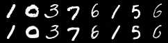

# Variational Autoencoder (VAE) - ELBO Derivation and Implementation

A comprehensive guide to understanding and implementing Variational Autoencoders, including a detailed mathematical derivation of the Evidence Lower Bound (ELBO).

## Overview

A **Variational Autoencoder (VAE)** is a generative model that learns to encode data into a latent space and decode it back to the original space. Unlike standard autoencoders, VAEs learn a probabilistic mapping, which enables:

- **Generation of new samples** by sampling from the learned latent distribution
- **Smooth interpolation** between data points in latent space
- **Regularized latent representations** that capture meaningful variations in data

This repository provides both a rigorous mathematical derivation of the VAE objective function (ELBO) and a practical implementation.

---

## Mathematical Derivation

### 1. The Goal: Maximize Log-Likelihood

Our goal in any generative model is to model the true data distribution $p(x)$. We do this by defining a model $p_\theta(x)$ with parameters $\theta$ and trying to maximize the log-likelihood of our data: $\log p_\theta(x)$.

To create a more powerful model, we introduce a latent variable $z$. This "marginalizes" the likelihood over $z$:

```math
p_\theta(x) = \int p_\theta(x|z) p(z) dz
```

This integral is **intractable** because it requires integrating over all possible values of the high-dimensional latent space $z$. This means we cannot optimize $\log p_\theta(x)$ directly.

---

### 2. The "Variational" Trick: Introduce an Approximation

Since we can't compute $p_\theta(x)$, we also can't compute the true posterior $p_\theta(z|x)$ (the "ideal" encoder) because of Bayes' theorem:

```math
p_\theta(z|x) = \frac{p_\theta(x|z)p(z)}{p_\theta(x)} \quad \leftarrow \text{Intractable denominator}
```

The core idea of variational inference is to **approximate** this intractable posterior $p_\theta(z|x)$ with a simpler, learnable distribution. We call this our "variational approximation," or the **Encoder**, $q_\phi(z|x)$.

Our goal is to make our approximation $q_\phi(z|x)$ as "close" as possible to the true posterior $p_\theta(z|x)$. We measure this "closeness" using the **Kullback-Leibler (KL) Divergence**.

---

### 3. The Derivation: From KL to ELBO

We start with the KL divergence between our approximation (Encoder $q$) and the true posterior ($p$):

```math
D_{KL}(q_\phi(z|x) \parallel p_\theta(z|x))
```

By definition, a KL divergence is always non-negative: $D_{KL}(\dots) \ge 0$.

Now, let's expand the definition of KL divergence:

```math
D_{KL}(q_\phi(z|x) \parallel p_\theta(z|x)) = \mathbb{E}_{q_\phi(z|x)} \left[ \log \left( \frac{q_\phi(z|x)}{p_\theta(z|x)} \right) \right]
```

```math
= \mathbb{E}_{q_\phi(z|x)} \left[ \log q_\phi(z|x) - \log p_\theta(z|x) \right]
```

Now, we use **Bayes' theorem** on the $\log p_\theta(z|x)$ term: $\log p_\theta(z|x) = \log p_\theta(x,z) - \log p_\theta(x)$.

```math
= \mathbb{E}_{q_\phi(z|x)} \left[ \log q_\phi(z|x) - (\log p_\theta(x,z) - \log p_\theta(x)) \right]
```

```math
= \mathbb{E}_{q_\phi(z|x)} \left[ \log q_\phi(z|x) - \log p_\theta(x,z) + \log p_\theta(x) \right]
```

Let's split the expectation. Note that $\log p_\theta(x)$ is a constant with respect to $z$, so its expectation $\mathbb{E}_{q_\phi(z|x)}[\log p_\theta(x)]$ is just $\log p_\theta(x)$.

```math
= \mathbb{E}_{q_\phi(z|x)} \left[ \log q_\phi(z|x) - \log p_\theta(x,z) \right] + \log p_\theta(x)
```

So, we have the full equation:

```math
D_{KL}(q_\phi(z|x) \parallel p_\theta(z|x)) = \mathbb{E}_{q_\phi(z|x)} \left[ \log q_\phi(z|x) - \log p_\theta(x,z) \right] + \log p_\theta(x)
```

Let's rearrange this to solve for our original (intractable) goal, $\log p_\theta(x)$:

```math
\log p_\theta(x) = D_{KL}(q_\phi(z|x) \parallel p_\theta(z|x)) - \mathbb{E}_{q_\phi(z|x)} \left[ \log q_\phi(z|x) - \log p_\theta(x,z) \right]
```

Flip the sign in the expectation term by inverting the fraction:

```math
\log p_\theta(x) = D_{KL}(q_\phi(z|x) \parallel p_\theta(z|x)) + \mathbb{E}_{q_\phi(z|x)} \left[ \log \left( \frac{p_\theta(x,z)}{q_\phi(z|x)} \right) \right]
```

---

### 4. Understanding the Equation

This is the most important equation:

```math
\log p_\theta(x) = \underbrace{D_{KL}(q_\phi(z|x) \parallel p_\theta(z|x))}_{\text{The "KL Gap"} \ge 0} + \underbrace{\mathcal{L}(\phi, \theta)}_{\text{The ELBO}}
```

Where $\mathcal{L}(\phi, \theta) = \mathbb{E}_{q_\phi(z|x)} \left[ \log \left( \frac{p_\theta(x,z)}{q_\phi(z|x)} \right) \right]$.

This tells us:
1.  **It's a "Lower Bound"**: Since the $D_{KL}$ term is always $\ge 0$, we know that $\log p_\theta(x) \ge \mathcal{L}(\phi, \theta)$. This means $\mathcal{L}$ is a **Lower Bound** on the (log) Evidence.
2.  **It's Our Objective**: We want to maximize $\log p_\theta(x)$. Since we can't optimize it directly, we optimize its lower bound $\mathcal{L}(\phi, \theta)$ instead. By pushing up the "floor" (the ELBO), we push up the "ceiling" (the true log-likelihood).
3.  **A Dual Goal**: Maximizing $\mathcal{L}$ is also *equivalent* to minimizing the $D_{KL}$ "gap," which forces our approximation $q_\phi(z|x)$ to become a better match for the true posterior $p_\theta(z|x)$.

---

### 5. Deconstructing the ELBO for the Loss Function

Now, let's take our ELBO $\mathcal{L}(\phi, \theta)$ and rearrange it into the form we use as a loss function.

```math
\mathcal{L}(\phi, \theta) = \mathbb{E}_{q_\phi(z|x)} \left[ \log \left( \frac{p_\theta(x,z)}{q_\phi(z|x)} \right) \right]
```

```math
= \mathbb{E}_{q_\phi(z|x)} \left[ \log p_\theta(x,z) - \log q_\phi(z|x) \right]
```

Using the chain rule of probability, $p_\theta(x,z) = p_\theta(x|z)p(z)$:

```math
= \mathbb{E}_{q_\phi(z|x)} \left[ \log(p_\theta(x|z)p(z)) - \log q_\phi(z|x) \right]
```

```math
= \mathbb{E}_{q_\phi(z|x)} \left[ \log p_\theta(x|z) + \log p(z) - \log q_\phi(z|x) \right]
```

Let's group the terms:

```math
= \mathbb{E}_{q_\phi(z|x)} \left[ \log p_\theta(x|z) \right] + \mathbb{E}_{q_\phi(z|x)} \left[ \log p(z) - \log q_\phi(z|x) \right]
```

```math
= \mathbb{E}_{q_\phi(z|x)} \left[ \log p_\theta(x|z) \right] - \mathbb{E}_{q_\phi(z|x)} \left[ \log q_\phi(z|x) - \log p(z) \right]
```

The second term is just the definition of the KL divergence: $\mathbb{E}_q \left[ \log \left( \frac{q}{p} \right) \right] = D_{KL}(q \parallel p)$.

```math
\mathcal{L}(\phi, \theta) = \underbrace{\mathbb{E}_{q_\phi(z|x)} \left[ \log p_\theta(x|z) \right]}_{\text{Term 1: Reconstruction}} - \underbrace{D_{KL}(q_\phi(z|x) \parallel p(z))}_{\text{Term 2: Regularization}}
```

---

### 6. The Final Loss Function

This is the final form of the ELBO that we **maximize**. In practice, most frameworks (like PyTorch) *minimize* a loss. So, we just take the *negative* ELBO as our loss function:

**Loss** = $-\mathcal{L}(\phi, \theta)$

```math
\text{Loss} = - \mathbb{E}_{q_\phi(z|x)} \left[ \log p_\theta(x|z) \right] + D_{KL}(q_\phi(z|x) \parallel p(z))
```

This gives us our two famous terms:

#### **Term 1: Reconstruction Loss**
* $- \mathbb{E}_{q_\phi(z|x)} \left[ \log p_\theta(x|z) \right]$
* This is the "negative log-likelihood" of the decoder.
* It asks: "Given a $z$ from the encoder, how well can the decoder reconstruct the original $x$?"
* If we assume a Gaussian decoder, this term simplifies to **Mean Squared Error (MSE)**. If we assume a Bernoulli decoder, it simplifies to **Binary Cross-Entropy (BCE)**.

#### **Term 2: Regularization Loss (KL Divergence)**
* $D_{KL}(q_\phi(z|x) \parallel p(z))$
* This is the KL divergence between our encoder's "fuzzy region" $q_\phi(z|x)$ and the simple "tidy" prior $p(z)$ (which we choose to be $\mathcal{N}(0, I)$).
* It acts as a **regularizer**, forcing the encoder to keep the latent space smooth and continuous.
* For Gaussian distributions, this has a closed-form solution:

```math
D_{KL}(q_\phi(z|x) \parallel p(z)) = -\frac{1}{2} \sum_{j=1}^{J} \left( 1 + \log(\sigma_j^2) - \mu_j^2 - \sigma_j^2 \right)
```

---

## Results

### Generated Images

*Figure 1: Images generated by sampling from the learned latent space*

### Reconstructed Images

*Figure 2: Original images (top) and their reconstructions (bottom) after 15 epochs*

The model successfully learns to:
- Encode input images into a compact latent representation
- Generate new, coherent samples from random noise
- Reconstruct input images with high fidelity
- Create smooth interpolations between different samples in latent space

---
